# IceHockey Tracking

## Motivation

The NHL is using real-time tracking technology in pucks and on the back of players' jerseys, shooting to generate more data for teams, broadcasters, fans and gamblers.
source: https://apnews.com/article/nhl-technology-sports-business-hockey-598b28664151ed1bebacd2e8b31f70d1

## Description

The idea is that if triangular zones could be placed in the captured image, it would be possible to know the position of the players on the field.

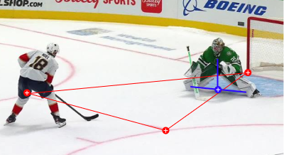
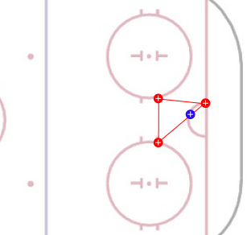

### Why triangles?

3 vertices is the minimum unit of points to locate an object in a plane and transpose it.

The condition is to know exactly the positions of the vertices of the triangle in both planes, hence the need to use fixed reference points (marks in the rink).

It is possible to calculate the position of the player within the triangle using a Barycentric coordinate system.

https://en.wikipedia.org/wiki/Barycentric_coordinate_system


## Requirements

- Anaconda , Jupyter
- Python 3.*
- Blender 2.8

### Marks / Trackers

- Goal line
- Face off spots
- Blue line
- Central red line
- Faceoff spot in neutral zone
- Trapezoids 

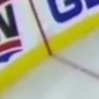
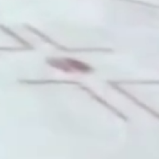
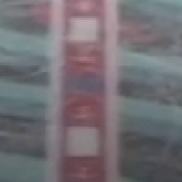
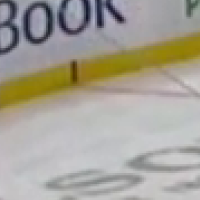
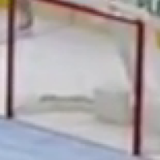
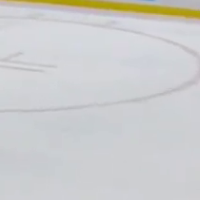
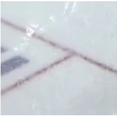
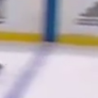
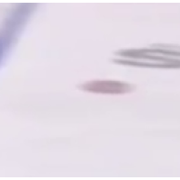
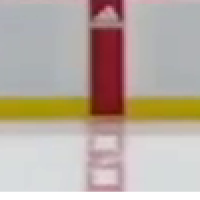
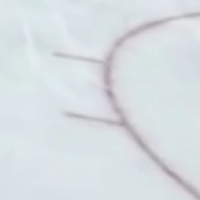

Using these marks it is possible to create a grid that divides the playing field into triangles.
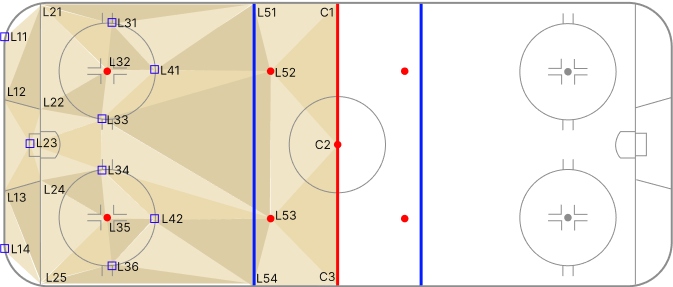

## Tracking

This is the most complicated and inaccurate part due to several factors.
The task consists first of capturing images or videos of the game.
Then we must locate in each scene the visible markers in the image field.
It would be possible to guess the position of the markers that are outside the image field, but this would only create more inaccuracy in the coordinate system.

Blender (2.8) has been used for the positioning of the markers on the video.
https://www.blender.org/


Once the rink and player markers are positioned on the timeline, it is possible to obtain the coordinates, marker name, player label for each frame of the scene by means of a python script.

**Example rink marker**

- name: (str) marker name
- coors: (list)
  - x: (int) blender woorld x coordinate
  - y: (int) blender woorld x coordinate
  - frame: (int) blender timeline frame
  - 
```
 {
    "name": "C1",
    "coors": [
        [
            6.734,
            1.806,
            765   
        ],
```

**Example rink marker**
- name: (str) marker name
- num:   (str) player number (labeled)
- coors: 
  - x: (int) blender woorld x coordinate
  - y: (int) blender woorld x coordinate
  - frame: (int) blender timeline frame
  
```
{
  "name": "P_LOC_1",
  "num": 24,    
  "coors": [
      [
          1.91,  
          1.41,
          765 
      ],
```


## Challenge: Manually / Machine Tracking

The biggest challenge is to automate reliably the positioning and labeling of the elements in the image.
The manual process is more reliable but extremely slow if you want to analyze animated scenes.

For this reason, it would be less costly for a manual process to focus on the analysis of certain scenes or frames of the game.

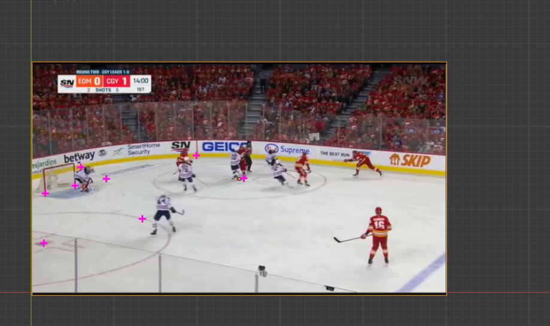
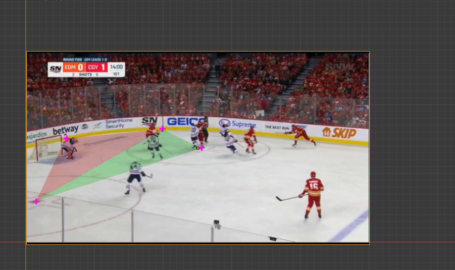
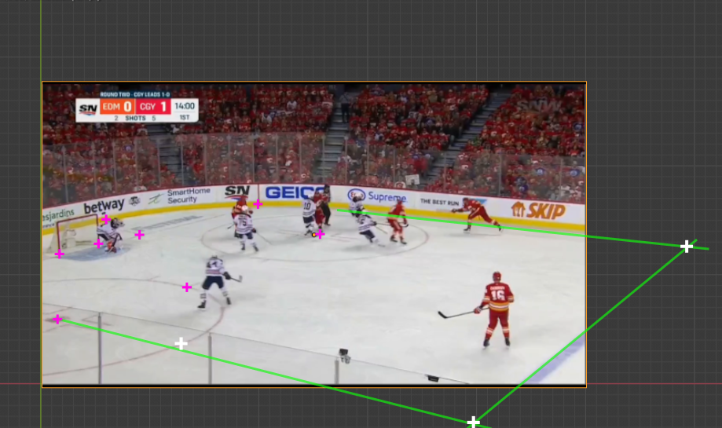
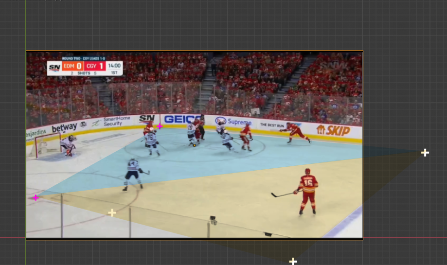

the challenges are:
- identify marker and side of the rink
- identify players: team, number
- out-of-field-of-view perspective and markers


## Tracking output

Once the coordinates of the elements in the scene have been extracted, it is necessary to calculate, according to the markers, the real position of the players.

For this purpose a series of Jupyter Notebooks have been created that apply the formula of the coordinate system, correct the data and allow to create the plots for each frame. 

## Result

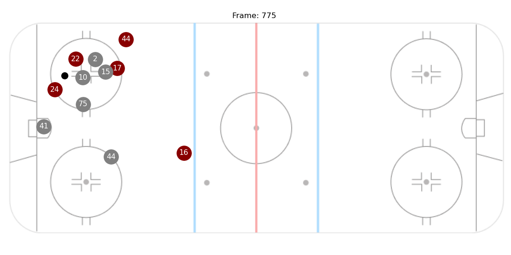
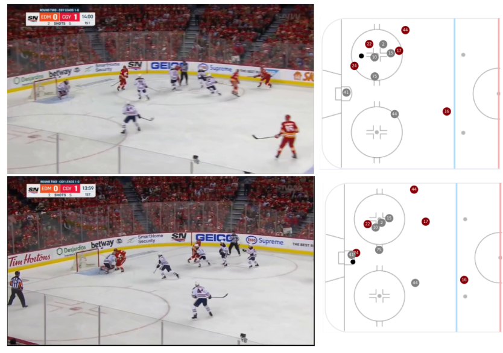


## Next steps

- automate marker positioning
- automate player labeling: player number, team
- animation of scenes in plots
- calculation of real distances
- calculation of displacement speed
- strategy analysis
  - angles
  - weaknesses
  - team formations
